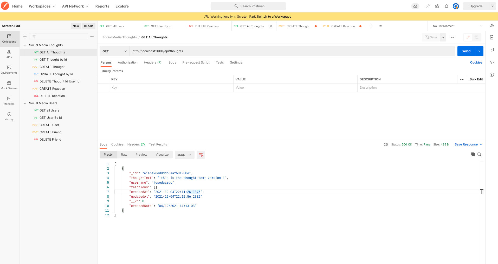

# social-medial API

## Description

Create a basic API for a social media, with crud operations, for users, thoughts and friends.

## Table of Contents

- [Usage](#usage)
- [Technology](#Technology)
- [Questions](#questions)
- [License](#license)

## Usage

You need donwload this project and installa the package, then run the node server and query your api using postman or insomnia

## Technology

- node
- express
- moment
- mongoDB

## Questions

for any questions feel free to contact me to joseduardo15062005@gmail.com

checkout the [GitHub profile](https://github.com/joseduardo15062005)

## License

Code released under the MIT License [License](https://choosealicense.com/licenses/mit/).
for additional questions please feel free to contact us via email at joseduardo15062005@gmail.com
